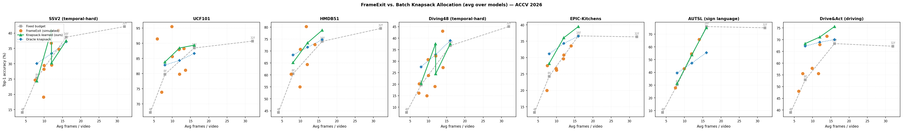
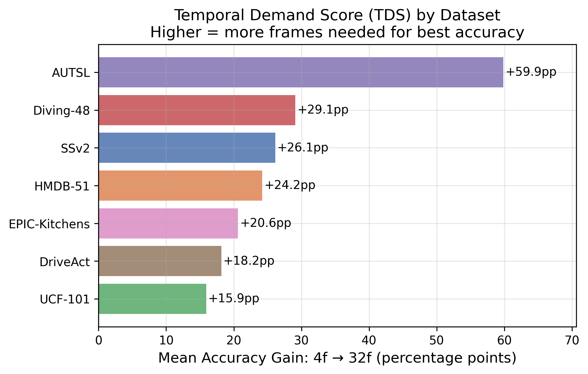
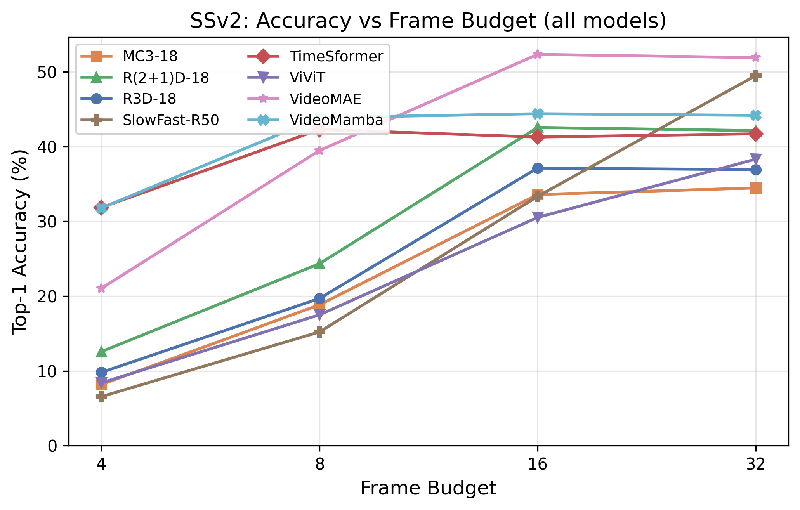

# InfoRates: Adaptive Temporal Frame Allocation for Video Recognition

<div align="center">

**ACCV 2026** · Mi3 Lab · University of São Paulo

[Paper](#) · [arXiv](#) · [BibTeX](#citation)

</div>

---

> Every action class has a *temporal frequency* — sample below it and you get aliasing: different actions become indistinguishable. We provide the first systematic characterization of temporal aliasing frequencies across 7 diverse datasets and 8 architectures (CNNs, Transformers, and SSMs), introducing the **Temporal Demand Score (TDS)** as a principled, model-independent measure of a dataset's Nyquist rate. We further show that **aliasing behavior is architecture-dependent**: VideoMamba (SSM) aliases 4–16× less than CNNs on the same dataset, while TimeSformer's divided attention is 4× more robust than ViViT's factorized attention.

<p align="center">
  
</p>

---

## Method

InfoRates characterizes each dataset's **Temporal Demand Score (TDS)** — how much accuracy is lost when reducing the frame budget from 32 to 4 frames. Using TDS and per-video temporal signals, we route each video to the minimum frame budget that preserves accuracy.

<p align="center">
  
</p>

**Key findings:**
- TDS is a *dataset* property, not a model property — the ranking is consistent across all 8 architectures tested
- AUTSL (sign language) and Diving-48 demand the most frames; UCF-101 is mostly appearance-driven
- Our adaptive routers (FDE, Spectral, Confidence Cascade, Knapsack) save 30–50% of frame compute on low-TDS datasets with no accuracy drop

---

## Results

<p align="center">
  
</p>

Fixed-budget Top-1 accuracy across 7 datasets and 8 models (4 / 8 / 16 / 32 frames):

<details>
<summary><b>Something-Something v2 (174 classes)</b></summary>

| Model | 4f | 8f | 16f | 32f |
|-------|---:|---:|----:|----:|
| R3D-18 | 9.8% | 19.7% | 37.1% | 36.9% |
| MC3-18 | 8.2% | 18.8% | 33.6% | 34.5% |
| R2Plus1D-18 | 12.6% | 24.3% | 42.6% | 42.1% |
| SlowFast-R50 | 6.6% | 15.2% | 33.3% | 49.5% |
| TimeSformer | 31.8% | 42.3% | 41.3% | 41.7% |
| ViViT | 8.4% | 17.5% | 30.5% | 38.3% |
| VideoMAE | 21.0% | 39.5% | **52.3%** | 51.9% |
| VideoMamba | 31.8% | **43.9%** | 44.4% | 44.2% |

</details>

<details>
<summary><b>UCF-101 (101 classes)</b></summary>

| Model | 4f | 8f | 16f | 32f |
|-------|---:|---:|----:|----:|
| R3D-18 | 59.5% | 72.6% | 81.2% | 81.4% |
| MC3-18 | 72.9% | 80.9% | 85.4% | 85.1% |
| R2Plus1D-18 | 70.0% | 81.6% | 88.6% | 89.0% |
| SlowFast-R50 | 50.1% | 66.2% | 81.3% | 87.6% |
| TimeSformer | 90.0% | 91.0% | 91.2% | 90.9% |
| ViViT | 75.3% | 86.9% | 92.5% | 94.3% |
| VideoMAE | 81.4% | 91.4% | 95.4% | **95.5%** |
| VideoMamba | 85.0% | **88.4%** | 88.2% | 87.8% |

</details>

<details>
<summary><b>HMDB-51 · DriveAct · Diving-48 · AUTSL · EPIC-Kitchens</b></summary>

| Model | HMDB-51 @16f | DriveAct @16f | Diving-48 @32f | AUTSL @16f | EPIC @16f |
|-------|-------------:|--------------:|---------------:|-----------:|----------:|
| R3D-18 | 80.3% | 68.3% | 28.8% | 75.0% | 37.2% |
| MC3-18 | 78.6% | 69.0% | 33.4% | 63.7% | 36.2% |
| R2Plus1D-18 | 73.1% | 62.5% | 34.7% | 75.9% | 35.5% |
| SlowFast-R50 | 79.3% | 72.5% | **50.5%** | **82.3%** | 39.4% |
| TimeSformer | 80.0% | 68.8% | 38.0% | 67.0% | 31.5% |
| ViViT | 80.2% | 67.4% | 53.0% | 74.6% | 32.9% |
| VideoMAE | **84.4%** | **74.1%** | 49.9% | 79.5% | **37.7%** |
| VideoMamba | 69.7% | 58.0% | 31.4% | 0.4%† | 28.4% |

† VideoMamba does not converge on AUTSL: K400 backbone produces near-identical features for sign language clips (feature collapse). All other models learn normally.

</details>

**Temporal Demand Score by dataset** (mean accuracy gain 4→32 frames, all models):

| AUTSL | Diving-48 | SSv2 | HMDB-51 | EPIC | DriveAct | UCF-101 |
|------:|----------:|-----:|--------:|-----:|---------:|--------:|
| +59.9pp | +29.1pp | +26.1pp | +24.2pp | +20.6pp | +18.2pp | +15.9pp |

---

## Installation

```bash
# Standard models (CNNs + Transformers)
git clone https://github.com/mi3lab/infoRates
cd infoRates
python -m venv .venv && source .venv/bin/activate
pip install -r requirements.txt
pip install -e .

# VideoMamba (SSM) — requires separate environment
python -m venv .venv_mamba && source .venv_mamba/bin/activate
pip install -r requirements_mamba.txt
pip install -e .
```

**Requirements:** Python 3.10+, CUDA GPU (tested on A100 40GB and H200 141GB), ~512 GB storage.

---

## Datasets

| Dataset | Path | Classes | Source |
|---------|------|---------|--------|
| SSV2 | `data/Something_data/` | 174 | [Qualcomm AI](https://developer.qualcomm.com/software/ai-datasets/something-something) |
| UCF-101 | `data/UCF101_data/` | 101 | [UCF](https://www.crcv.ucf.edu/data/UCF101.php) |
| HMDB-51 | `data/HMDB51_data/` | 51 | [Brown](https://serre-lab.clps.brown.edu/resource/hmdb-a-large-human-motion-database/) |
| Diving-48 | `data/Diving48_data/` | 48 | [SVCL](http://www.svcl.ucsd.edu/projects/action_quality_assessment/) |
| EPIC-Kitchens | `data/EPIC_data/` | 97 | [EPIC-Kitchens-100](https://epic-kitchens.github.io/2022) |
| AUTSL | `data/AUTSL_data/` | 226 | [Kaggle](https://www.kaggle.com/datasets/sttaseen/autsl) |
| DriveAct | `data/DriveAct_data/` | 34 | [driveact.de](https://driveact.de/) |

```bash
# Preprocessing (AUTSL and DriveAct only)
python scripts/accv2026/preprocess_autsl.py
python scripts/accv2026/preprocess_driveact.py

# EPIC-Kitchens clip extraction
python scripts/accv2026/download_epic_clips.py
```

---

## Training

All scripts are idempotent — they skip training if a checkpoint exists and skip evaluation if results exist.

```bash
# CNN models (R3D-18, MC3-18, R2Plus1D-18, SlowFast-R50) — A100
export DATASET=ssv2   # ssv2 | ucf101 | hmdb51 | diving48 | epic_kitchens | autsl | driveact
bash scripts/accv2026/run_a100_dataset_all_cnn.sh

# Transformer models (TimeSformer, ViViT, VideoMAE) — H200
bash scripts/accv2026/run_h200_dataset_all_transformer.sh

# VideoMamba (SSM) — H200, requires .venv_mamba
DATASET=ssv2 bash scripts/accv2026/run_h200_multidata_videomamba.sh
```

---

## Evaluation

**Phase 1 (Fixed-budget baseline):** Complete — 8 models × 7 datasets × 4 budgets [4/8/16/32 frames]

**Phase 2 (Coverage × Stride aliasing sweep):** Running — 56 jobs auto-submitting, real-time monitoring:

```bash
# View W&B live results
https://wandb.ai/mi3lab/inforates-accv2026

# Monitor job queue
watch -n 5 'squeue -u $USER --format="%.10i %.22j %.8T %20K %P"'

# Single model evaluation
python scripts/accv2026/eval_fixed_budget.py \
    --manifest  evaluations/accv2026/manifests/ssv2_val_20_per_class.csv \
    --checkpoint fine_tuned_models/accv2026_videomae_ssv2_full_e5_h200 \
    --budgets 4 8 16 32 \
    --model-frames 16 \
    --output-dir evaluations/accv2026/fixed_budget/my_run

# Coverage×Stride sweep for 1 model+dataset
python scripts/accv2026/sweep_coverage_stride.py --model r3d_18 --dataset ucf101

# Full analysis pipeline (post-sweep)
bash scripts/accv2026/run_post_completion_analyses.sh --all
```

Figures are saved as **PDF** (for LaTeX) and **PNG at 300 DPI** (for review/slides) in `evaluations/accv2026/paper_results/figures/`.

---

## Citation

```bibtex
@inproceedings{maia2026inforates,
  title     = {InfoRates: Adaptive Temporal Frame Allocation for Video Recognition},
  author    = {Maia, Wesley and others},
  booktitle = {Proceedings of the Asian Conference on Computer Vision (ACCV)},
  year      = {2026}
}
```

---

## License

This project is licensed under the MIT License. See [LICENSE](LICENSE) for details.

VideoMamba backbone weights are from [OpenGVLab/VideoMamba](https://github.com/OpenGVLab/VideoMamba) (MIT License).
